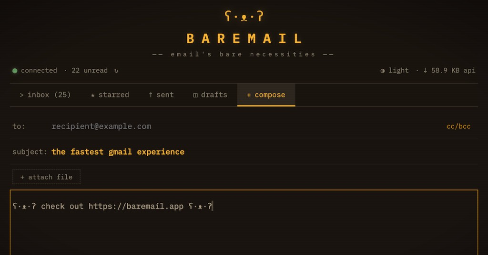

# BAREMAIL ʕ·ᴥ·ʔ

**Email's bare necessities.** A minimalist Gmail client for low-bandwidth environments — airplane wifi, rural connections, developing regions, or any situation where Gmail's full interface is too heavy.

```
  ʕ·ᴥ·ʔ
  BAREMAIL
  ── email's bare necessities ──
```



## What is BAREMAIL?

BAREMAIL is a Progressive Web App that talks directly to the Gmail API. The entire app shell is under 200KB gzipped, cached by a service worker, and then the only network traffic is Gmail API JSON — the UI itself costs zero bytes on repeat visits.

- **App shell: ~60KB** gzipped (Preact + HTM + your styles and logic)
- **Inbox load: ~3-5KB** of API data for 25 messages
- **Single email: ~1-3KB** for a typical text message
- **Offline-first:** read cached emails, compose and queue messages with no connection
- **Zero-install:** works in any modern browser, installable as a PWA

## Features

- Inbox with unread indicators, starring, and archive
- Mobile compatible progressive web app
- Plain text message reader with typewriter effect
- Compose, reply, and forward (plain text)
- Search via Gmail's query syntax
- Labels: Inbox, Starred, Sent, Drafts
- Light/dark theme (respects system preference)
- Keyboard shortcuts (j/k navigate, o open, c compose, r reply, e archive)
- Offline compose with outbox queue and background sync
- Connection status indicator with bandwidth estimates
- Inbox zero bear mascot with animated ASCII scenes
- Hidden mini-game: Honey Catcher

## Quick Start (~3 minutes)

```bash
npm install
npm start
```

Open [http://localhost:3000](http://localhost:3000) and the built-in setup wizard walks you through connecting to Gmail:

```
  ʕ·ᴥ·ʔ  BAREMAIL

  ʕ·ᴥ·ʔ setup guide                     ~3 minutes
  ● ○ ○ ○ ○ ○
  step 1 of 6

  ┌─────────────────────────────────────────────┐
  │  create a google cloud project              │
  │                                             │
  │  click the link below to create a new       │
  │  google cloud project. name it anything     │
  │  you like (e.g. "BAREMAIL").                │
  │                                             │
  │  ┌───────────────────────────────┐          │
  │  │ open google cloud console →   │          │
  │  └───────────────────────────────┘          │
  │                                             │
  │  ▸ need a google account?                   │
  └─────────────────────────────────────────────┘
              ┌──────────────────────┐
              │  done, next step →   │
              └──────────────────────┘
```

The wizard has 7 steps (one optional) — each one opens the exact Google Cloud page you need, tells you what to click, and lets you paste your credentials directly into the app. No config files to edit.

**Video walkthrough:** [Watch the setup wizard in action](https://youtu.be/I9Jfs52-nf0)

> On first sign-in, you'll see a warning: "Google hasn't verified this app." This is normal for development. Click **Advanced** → **Go to BAREMAIL (unsafe)** to continue. Your data still goes directly to Google's API, never through a third party.

<details>
<summary><strong>Alternative setup methods</strong></summary>

**CLI setup (interactive):**
```bash
npm run setup
```
Opens each Google Cloud page in your browser and prompts for credentials in the terminal. Writes `config.js` automatically.

**Manual config file:**
```bash
cp config.example.js config.js
```
Edit `config.js` and paste your Client ID and Client Secret:
```js
window.BAREMAIL_CONFIG = {
  GOOGLE_CLIENT_ID: 'your-client-id.apps.googleusercontent.com',
  GOOGLE_CLIENT_SECRET: 'your-client-secret',
  GOOGLE_REDIRECT_URI: window.location.origin,
};
```

> **Note on the client secret:** This is visible in the source code, which is expected for browser-based apps using Google's "Web application" OAuth type. The PKCE flow protects against authorization code interception, and the secret alone can't access anyone's data without user consent.

**Manual steps reference:**

1. [Create a Google Cloud project](https://console.cloud.google.com/projectcreate)
2. [Enable the Gmail API](https://console.cloud.google.com/apis/library/gmail.googleapis.com)
3. [Configure OAuth consent screen](https://console.cloud.google.com/apis/credentials/consent) — select External, fill in app name + emails
4. [Add yourself as a test user](https://console.cloud.google.com/auth/audience) — scroll to Test Users, add your Gmail address
5. *(Optional)* Set up ngrok for mobile — see [Install on iPhone / iPad](#install-on-iphone--ipad) below
6. [Create OAuth credentials](https://console.cloud.google.com/apis/credentials/oauthclient) — Web application, add `http://localhost:3000` to origins and redirect URIs (plus your ngrok URL if using mobile)
7. Paste Client ID and Client Secret into the app or `config.js`

</details>

### Install as a PWA (use from your dock)

BAREMAIL is designed to be used as an installed app, not a browser tab. Once installed, the service worker caches everything locally — the app launches instantly from your dock and API calls go directly to Gmail. No server needed after installation.

**Chrome (recommended):**
1. Visit `http://localhost:3000`
2. Click the **⋮** menu (top-right) → **Cast, save, and share** → **Install page as app...**
   - Alternatively, look for the install icon (⊕) in the address bar — but this doesn't always appear
3. BAREMAIL now appears in your dock, Launchpad, and Spotlight

**Safari (macOS Sonoma+):**
1. Visit `http://localhost:3000`
2. Go to **File → Add to Dock**
3. BAREMAIL appears in your dock

**After installation:**
- Just click the BAREMAIL icon in your dock — it opens in its own window, no browser chrome
- The service worker serves the app from cache, so it launches instantly even if `npm start` isn't running
- To **update** the app after pulling new code: run `npm start` once, open BAREMAIL, and the service worker will pick up the new version in the background

### Install on iPhone / iPad

PWAs require HTTPS, so you'll need to tunnel your local server to get a public URL. [ngrok](https://ngrok.com) is the simplest way.

**One-time setup:**

1. Install ngrok:
   ```bash
   brew install ngrok    # macOS
   # or download from https://ngrok.com/download
   ```
2. Create a free account at [ngrok.com](https://ngrok.com) and run:
   ```bash
   ngrok config add-authtoken YOUR_TOKEN
   ```

**Expose your local server:**

1. Make sure BAREMAIL is running (`npm start`)
2. In a separate terminal:
   ```bash
   ngrok http 3000
   ```
3. Copy the `https://xxxx.ngrok-free.app` URL from the output

**Add the ngrok URL to Google OAuth:**

1. Go to [Google Cloud Console → Credentials](https://console.cloud.google.com/apis/credentials)
2. Click on your OAuth client ID
3. Add the ngrok URL to both **Authorized JavaScript origins** and **Authorized redirect URIs**
4. Click **Save**

**Install on your phone:**

1. Open **Safari** on your iPhone (must be Safari — other browsers on iOS don't support PWA installation)
2. Navigate to your `https://xxxx.ngrok-free.app` URL
3. If ngrok shows an interstitial page, tap through it
4. BAREMAIL will show the setup wizard — enter the same **Client ID** and **Client Secret** you used on your computer
5. Sign in with Google
6. Tap the **Share** button (square with arrow) → **"Add to Home Screen"** → **"Add"**
7. Open BAREMAIL from your home screen — it will show the setup wizard one more time (iOS uses separate storage for home screen apps). Enter your credentials again and sign in.

After that, BAREMAIL is fully installed. The service worker caches everything locally, so the app will keep working even after you shut down ngrok. You only need ngrok again to push new versions of the app to your phone.

> **Note:** ngrok's free tier generates a new URL each time you restart it. If you restart ngrok, you'll need to update your Google OAuth credentials with the new URL and re-add the PWA on your phone.

## Scripts

| Command | Description |
|---------|-------------|
| `npm start` | Production build + serve on port 3000 (use this) |
| `npm run setup` | Interactive setup — opens GCP pages and writes config.js |
| `npm run dev` | Dev server with sourcemaps (for development) |
| `npm run build` | Production build to `dist/` (for deployment) |
| `npm run watch` | Watch mode, rebuilds on change |

## Deployment (optional)

For personal use, `npm start` + PWA install is all you need. If you want to host it on a public URL:

BAREMAIL is just static files — deploy the `dist/` folder anywhere:

- **Cloudflare Pages:** connect your repo, build command `npm run build`, publish directory `dist`
- **Netlify / Vercel:** same setup
- **GitHub Pages:** push `dist/` to a `gh-pages` branch

Update your Google OAuth credentials with the production domain:
- Authorized JavaScript origins: add `https://yourdomain.com`
- Authorized redirect URIs: add `https://yourdomain.com`
- Add any users who need access as **test users** on the OAuth consent screen (until you go through Google's verification process)

## Architecture

```
Browser
├── App Shell (Preact + HTM, cached by service worker)
│   ├── Inbox view (message list, search, pagination)
│   ├── Reader view (plain text, attachments list)
│   ├── Compose view (send/reply/forward, offline queue)
│   └── Components (header, nav, footer, bear mascot)
├── Service Worker
│   ├── Cache-first for app shell
│   ├── Network-first for Gmail API
│   └── Background sync for outbox
├── IndexedDB
│   ├── Message cache (LRU, 1000 messages)
│   ├── Outbox queue
│   └── User preferences
└── Gmail REST API (direct, no backend)
```

## Privacy

BAREMAIL runs entirely in your browser. There is no backend server. Your emails go directly between your browser and Google's Gmail API. No data is ever sent to a third party.

OAuth tokens are stored locally. The app requests only the minimum scopes needed: read, send, and modify (for marking read/unread and archiving).

## Tech Stack

| Layer | Choice | Size |
|-------|--------|------|
| Framework | Preact + HTM | ~4KB gzipped |
| Language | TypeScript | Zero runtime cost |
| Styling | Single CSS file | ~5KB gzipped |
| Font | IBM Plex Mono (subset) | ~15KB gzipped |
| Build | esbuild | Fast, minimal config |
| Offline | Service Worker + IndexedDB | ~5KB |
| Search | MiniSearch (future) | ~8KB gzipped |

## Keyboard Shortcuts

| Key | Action |
|-----|--------|
| `j` / `k` | Navigate inbox up/down |
| `o` / `Enter` | Open selected email |
| `c` | Compose new email |
| `r` | Reply to current email |
| `e` | Archive current email |
| `Esc` | Back / discard |
| `Cmd+Enter` | Send message |

## Troubleshooting

**"Access blocked: This app has not completed the Google verification process"**
You didn't add yourself as a test user. Go to the [OAuth consent screen](https://console.cloud.google.com/apis/credentials/consent), click your app, go to the Test users section, and add your Gmail address.

**"Error 400: redirect_uri_mismatch"**
Your OAuth credentials are missing the redirect URI. Go to [Credentials](https://console.cloud.google.com/apis/credentials), click on your OAuth client, and make sure both **Authorized JavaScript origins** and **Authorized redirect URIs** include `http://localhost:3000` (exact match, no trailing slash).

**"Error 401: invalid_client"**
Double-check that you copied the full Client ID (it ends with `.apps.googleusercontent.com`). If using `config.js`, make sure the file is saved and you restarted the server.

**"Google hasn't verified this app"**
This is expected. Click **Advanced** → **Go to BAREMAIL (unsafe)**. This warning appears because your app is in testing mode. Your data still goes directly to Google's API.

## FAQ

**Why not just use Thunderbird / mutt / Apple Mail over IMAP?**

A few reasons:

1. **IMAP is chatty.** It requires many round trips to synchronize mailbox state, and re-establishing that state after a dropped connection is painful. On flaky airplane wifi, that matters — a lot. BAREMAIL talks to Gmail's REST API, which is single request/response per action with no persistent connection to maintain.
2. **Gmail is phasing out IMAP-friendly auth.** Gmail requires you to either enable "less secure app" access (being deprecated) or deal with proprietary OAuth flows that most desktop clients handle poorly. BAREMAIL uses the same OAuth + PKCE flow that Google's own apps use.
3. **Zero install, works anywhere.** BAREMAIL runs in any browser and installs as a PWA. No desktop app to configure, no IMAP settings to get right, nothing to sync across devices. Open it, sign in, done.
4. **It's a different use case.** If you already have a desktop mail client synced and ready to go, great — use it! BAREMAIL is for when you're on a plane, open your laptop, and Gmail won't load. No pre-synced mailbox needed; just a browser and a trickle of bandwidth.

**Why not just use regular Gmail? It works okay on bad connections.**

Gmail's web client is surprisingly well-optimized *if* you already have it cached. The problem is cold starts — if you haven't loaded Gmail recently (or at all on that device), you're downloading megabytes of JavaScript before you can read a single email. BAREMAIL's entire app shell is ~60KB gzipped and cached by a service worker after the first visit. After that, the only network traffic is the raw API data for your messages.

**Why not switch to Fastmail / Hey / ProtonMail / etc.?**

BAREMAIL isn't a mail service — it's a client. You keep your existing Gmail account, contacts, history, everything. It's free, open source, has no backend, and runs entirely in your browser. If you're happy with Gmail but want a lighter interface, that's what this is for.

**Why do I need to create a Google Cloud project? That sounds complicated.**

Google doesn't offer a simple "connect your app to Gmail" button — any third-party client needs OAuth credentials from a GCP project. There's no way around this without running a backend server (which would defeat the purpose of BAREMAIL). The built-in setup wizard walks you through each step, opens the exact GCP pages you need, and takes about 3 minutes.

**Is it safe to have the OAuth client secret in browser code?**

Yes. Google's OAuth documentation explicitly covers this case for browser-based ("single-page") apps. The client secret alone can't access anyone's data — it requires user consent via the OAuth flow, and BAREMAIL uses PKCE to protect against authorization code interception. This is the same model that any client-side Gmail integration uses.

**Can I use this with non-Gmail accounts?**

Not currently. BAREMAIL is built specifically for the Gmail REST API. Supporting generic IMAP would add significant complexity and reintroduce the round-trip problems that BAREMAIL is designed to avoid.

## Contributing

- Every PR must not increase the app shell beyond 200KB gzipped
- Runtime dependencies must be justified by their size-to-value ratio
- Features must degrade gracefully offline
- Feature rubric: "does this help on airplane wifi?"

## License

MIT — see [LICENSE](LICENSE)

## Support

If BAREMAIL saved you from staring at a loading spinner on airplane wifi, consider buying the bear a coffee:

```
      ʕ·ᴥ·ʔ ☕
      |    |/
      |    |    thx for the coffee!
     /|    |\
```

<a href="https://www.buymeacoffee.com/mzschwartz88"></a>

## Star History

[](https://star-history.com/#matt-virgo/baremail&Date)

## Thanks!